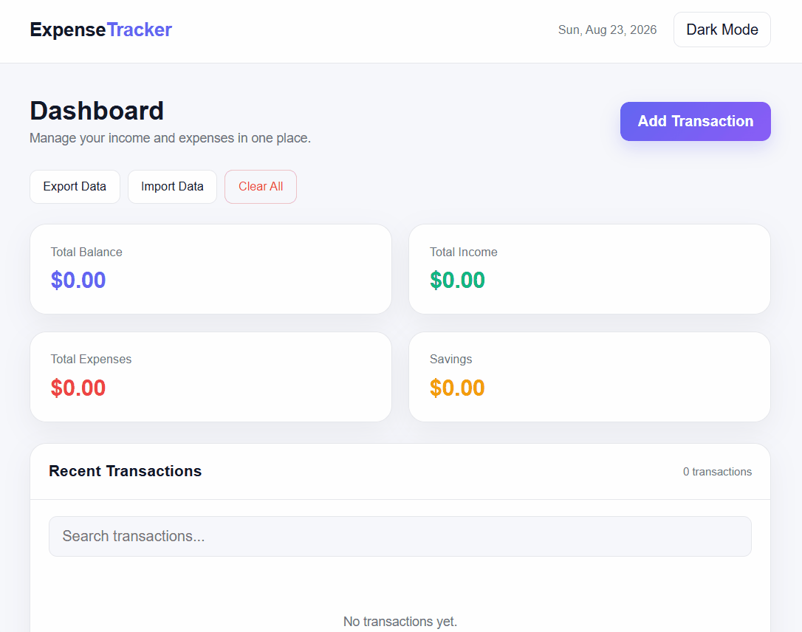

# Expense Tracker 💸

A clean, fully client-side expense tracker — track income and expenses, see your spending broken down by category, and view a weekly spending chart. No backend, no database — everything is saved locally in your browser.

Built as a personal project to practice vanilla JS state management, localStorage persistence, and building a proper dashboard UI without any framework.

---

## Demo



---

## Features

- Add, edit, and delete income or expense transactions
- Live summary cards — total balance, income, expenses, and savings
- Search/filter transactions by description or category
- Weekly spending chart (Mon–Sun) with hover tooltips showing exact amounts
- Category breakdown with progress bars showing spend distribution
- Export all data to a `.json` file, and import it back in later
- Clear all data with a confirmation step, so you don't nuke everything by accident
- Light/dark mode toggle, saved across sessions
- Fully responsive — works down to small mobile screens
- Toast notifications for every action (added, updated, deleted, imported, etc.)

## Tech Stack

No frameworks, no build tools, no dependencies.

- **HTML5** for structure
- **CSS3** — custom properties for theming, CSS Grid/Flexbox for layout
- **Vanilla JavaScript** — DOM manipulation, `localStorage` for persistence, no libraries

## Project Structure

expense-tracker/
├── index.html
├── style.css
├── script.js
└── README.md

## Possible Improvements

Ideas for later, or good first-contribution material:

- Monthly/yearly view instead of just the current week's chart
- Recurring transactions (rent, subscriptions, etc.)
- Multiple currency support
- Budget limits per category with alerts
- Sort transactions by amount/date instead of just newest-first

# Installation

1. Clone the repository

```bash
git clone https://github.com/ahsanstack/Expense-Trackor.git
```

2. Open the project folder.

3. Open `index.html` in your browser or run it using **Live Server** in Visual Studio Code.

---

## Author

**Ahsan**

- GitHub: https://github.com/ahsanstack

---
